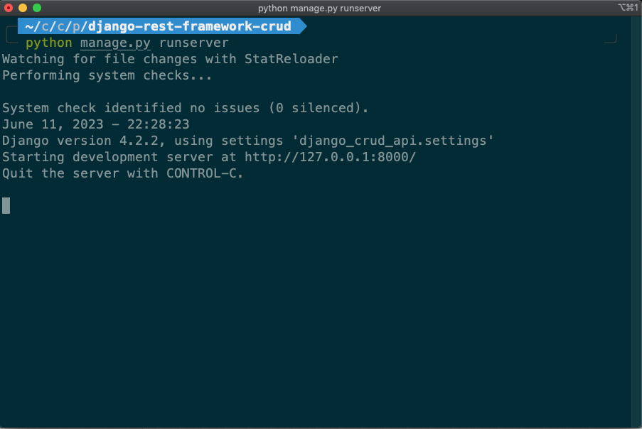
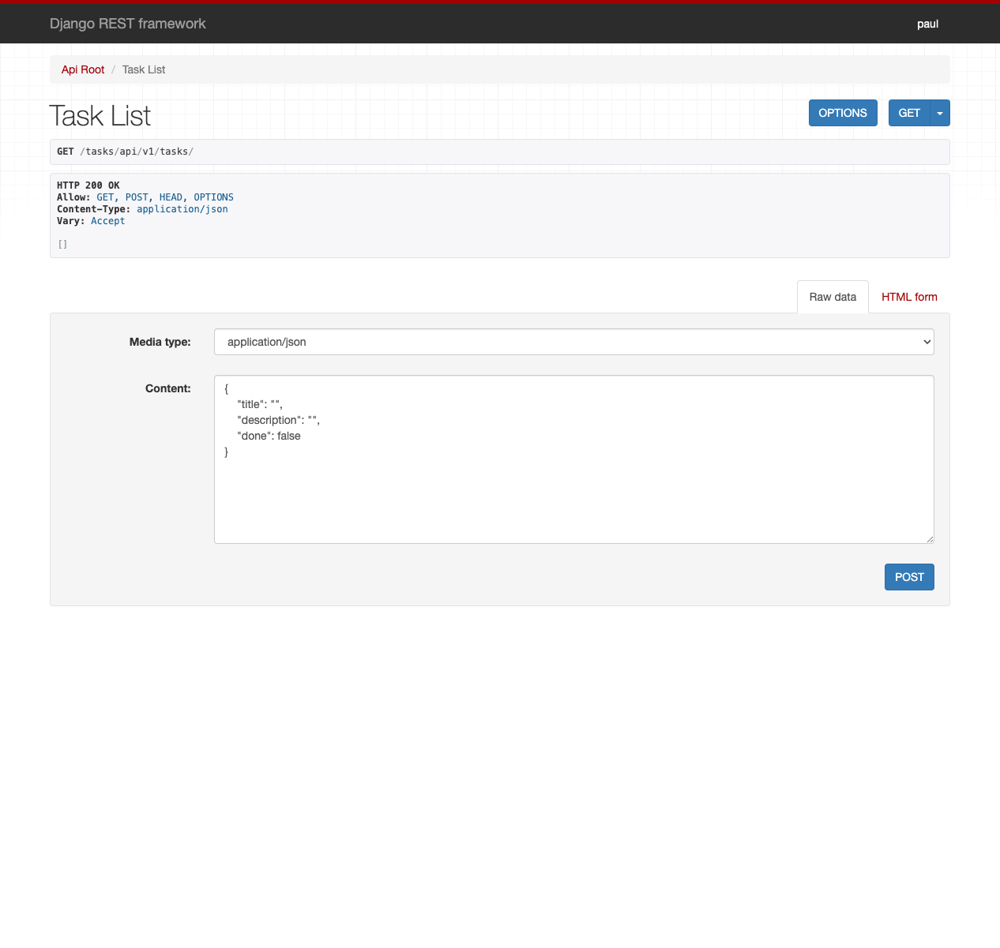
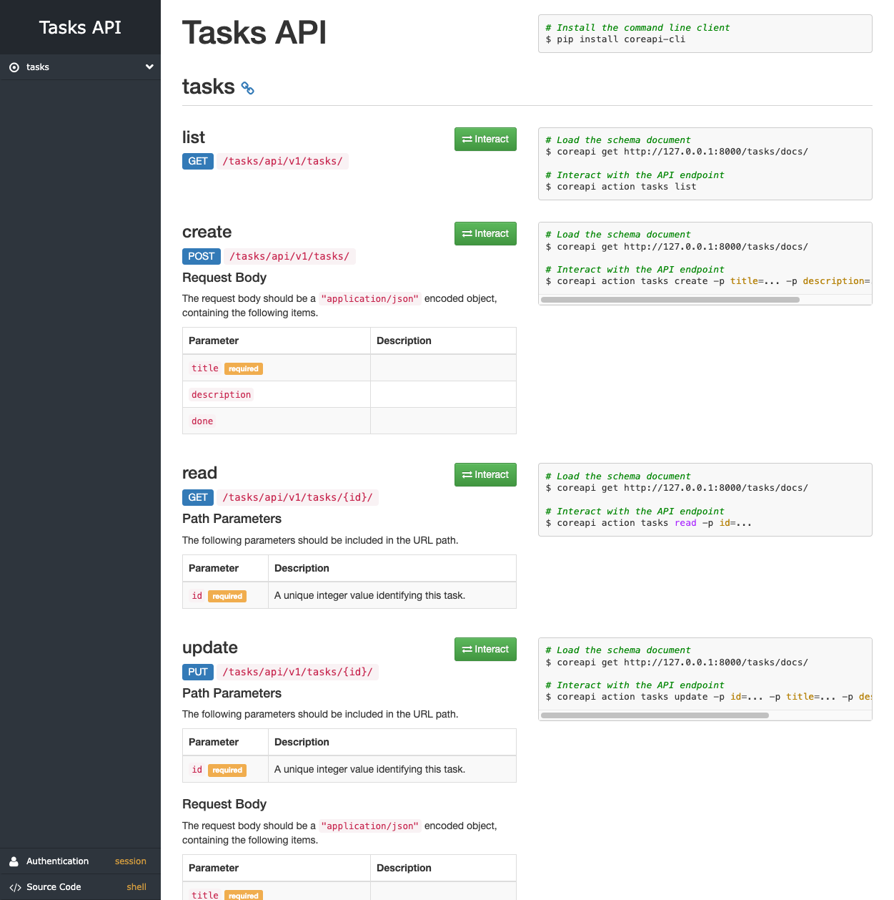

# Installation

## Description

CRUD of tasks using Django + REST FRAMEWORK

### Create Database with SQLite 3

If you want to create new database you can do it this way

```
sqlite3 db.sqlite3
.databases
.exit
```

## Install virtual environment

```
deactivate
python -m venv venv
source venv/bin/activate
```

## Install Python packages for this app

```
pip install --upgrade pip
pip install django djangorestframework django-cors-headers coreapi
```

#### Create tables in database

```
python manage.py migrate
```

#### Create admin user

```
python manage.py createsuperuser
```

#### Start server



```
python manage.py runserver
```

#### Web interface for Tasks


Open your browser on:

```
http://127.0.0.1:8000/tasks/api/v1/tasks/
```

#### How to see the web interface for Tasks


Open your browser on:

```
http://127.0.0.1:8000/tasks/docs/
```

## Customizations

**Settings File** : _django_crud_api/settings.py_

### CORS

For example if you want to test locally a frontend app running on port 5173 you mus tu set Django like this:

```
# django_crud_api/settings.py
CORS_ALLOWED_ORIGINS = [
    'http://localhost:5173'
]
```

### Secret Key

```
# django_crud_api/settings.py
# SECURITY WARNING: keep the secret key used in production secret!
SECRET_KEY = "your-custom-secret-key"
```

## Timezone

```
# django_crud_api/settings.py
TIME_ZONE = "UTC"
```

## Language

```
# django_crud_api/settings.py
LANGUAGE_CODE = "en-us"
```

## Last Update

July 19, 2024
